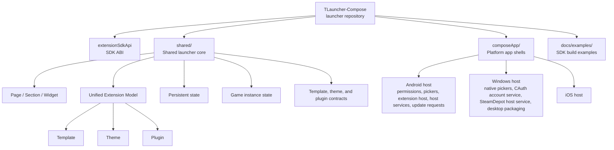

# TLauncher Compose

Current app version: `1.0.0`

TLauncher Compose is a cross-platform game launcher platform built with Compose Multiplatform.

This repository is organized around one launcher application and its extension SDK ABI:

- `composeApp/`: platform app shells
- `shared/`: shared launcher core
- `extensionSdkApi/`: developer-facing extension SDK ABI

The long-term goal is not just to ship a launcher for a single game. The project is evolving into an extensible launcher host where games, themes, and plugins can be added through a shared extension model.

## Project Goals

- Target `Windows`, `Android`, and `iOS`
- Keep most logic in shared code
- Leave platform modules responsible only for platform-only work
- Support templates, themes, and plugins as first-class extensions
- Keep the UI modern, minimal, and modular
- Persist real user data instead of treating important state as temporary UI state

## Repository Overview

```text
.
|- README.md
|- LICENSE
|- docs/
|- composeApp/
|- extensionSdkApi/
|- shared/
`- vendor/
```

## Architecture Diagram



## How The Pieces Fit Together

- `shared/` defines the launcher model, page system, extension pipeline, persistence, and game instance behavior.
- `composeApp/` hosts the shared app on each platform and provides the platform-only integrations that shared code cannot implement alone.
- `extensionSdkApi/` exposes the supported import surface for third-party extension projects.
- `TExtension` packages plug into the launcher through the shared extension system and are loaded by the host at runtime. Game-specific behavior belongs in template packages, not in the launcher core.
- Host-owned platform capabilities are exposed to extensions through typed SDK facades such as `ExtensionContext.hostServices`; extension projects should not import `core.*` or copy launcher-owned native/vendor libraries.
  Android and Windows both expose CAuth-backed Steam depot access through `SteamDepotService`, so game templates should call the SDK facade instead of loading CAuth or launcher internals directly.

### Launcher Repository

This is the launcher itself.

- `composeApp/`: platform entry points and app shells for Android, Windows, and iOS
- `extensionSdkApi/`: the stable developer-facing SDK ABI module for third-party extension projects
- `shared/`: the shared core where the launcher architecture and most business logic live

The repository no longer keeps live sample extension projects under `samples/`. Those in-tree sample builds aged too quickly and drifted away from the current SDK contract. The supported examples now live under `docs/examples/` as documentation-first templates.

## Architecture Summary

### 1. Shared-first launcher core

The launcher is designed so that most app logic lives in shared code:

- core models
- page composition
- instance management
- settings
- localization
- persistence
- extension registration
- template-driven behavior

Platform-specific code is kept for things that cannot be shared, such as:

- Android permissions
- native file and directory pickers
- Android extension host integration
- Android host service adapters
- system back behavior
- platform-specific update request implementations

On Windows, native file, extension-package, and directory selection use the
Windows Common Item Dialog. Dialogs are shown with the launcher window as their
owner so they remain modal to the app instead of opening as detached windows.

### 2. Unified extension model

Templates, themes, and plugins are treated as one broader concept: `Extension`.

The current architecture uses a unified extension model with a kind value rather than three unrelated top-level systems. That gives the host one pipeline for:

- registration
- source metadata
- load priority
- capability checks
- permission checks
- enable or disable state

Extension kinds currently include:

- `TEMPLATE`
- `THEME`
- `PLUGIN`

### 3. Page / Section / Widget UI tree

The launcher UI is built as a tree of:

- `Page`
- `Section`
- `Widget`

This allows official extensions and user-installed extensions to all contribute UI through the same structure.

Important rules:

- every screen is a page
- sections can be nested
- widgets are registered under sections
- templates and plugins can contribute to existing pages
- conflicts are resolved by exact path match plus load priority

This page system is the backbone for screens such as:

- Home
- Settings
- About
- Extension Manager
- game instance management
- game-specific tools contributed by template packages

### 4. Persistence-first data model

The launcher treats settings and user choices as persistent application data.

Persisted state includes, among other things:

- game instances
- selected game instance
- language
- theme
- extension load priority
- installed extension package state

### 5. Template packages describe game families

A template package represents a game family and the platform targets it supports. The launcher installs the package that matches the current host target.

## Current Product Shape

Today the project behaves more like an extensible launcher host than a fixed monolithic app.

Major user-facing areas already present in the codebase include:

- Home page with current game context
- Game instance creation, selection, editing, and deletion
- Settings with shared and extension-contributed sections
- Extension Manager with installed package state, enable or disable toggles, priority editing, and permission review
- Theme and language selection
- About page with GitHub Releases-based update checks
- Windows-native file, extension-package, and directory selection
- Android permissions, file selection, runtime validation, packaging, and extension host integration

## Extension SDK and `TExtension`

The repository already contains the first pass of the extension SDK pipeline.

Third-party extensions are packaged as `TExtension` files rather than plain JSON configuration. A package can contain executable runtime code and host metadata.

Current SDK direction:

- one extension model with a kind field
- capability-based registration
- host permission grants
- runtime JAR loading from `TExtension`
- `ExtensionEntrypoint` discovery and instantiation through the public `sdk.extension` ABI
- startup scanning from the installed extension directory
- extension enable or disable state
- permission review inside the launcher
- package replacement and stale load-failure clearing after a compatible overwrite install
- extension package resource access through `ExtensionContext.packageResources`
- host-owned service access through `ExtensionContext.hostServices`
- CAuth-backed `SteamDepotService` on Android and Windows
- Android-style SDK compatibility through minimum and target SDK API versions
- launcher icon control on supported platforms through `LauncherIconController`

Useful entry points:

- [SDK Glossary](docs/sdk-glossary.md)
- [How to Build a `TExtension`](docs/how-to-build-a-textension.md)
- [Extension SDK Architecture](docs/extension-sdk-architecture.md)
- [Extension SDK Packaging](docs/extension-sdk-packaging.md)
- [Capability Matrix and Host Permissions](docs/capability-matrix-and-host-permissions.md)
- [`TExtension` Package Format](docs/textension-package-format.md)
- [SDK Examples Index](docs/examples/README.md)
- [Minimal Plugin Entrypoint Example](docs/examples/minimal-plugin-entrypoint.kt)
- [Copyable Gradle Packaging Template](docs/examples/textension-plugin-build.gradle.kts)
- [GitHub Upload and Release Flow](docs/github-upload-and-release-flow.md)

To use the packaging template in a separate extension project:

```powershell
.\gradlew.bat packageTExtension
```

The package output should be written under your extension project's build output:

```text
build/dist/
```

## Platform Status

### Windows

- important Windows development target
- useful for general launcher UI work
- currently the most convenient environment for SDK and extension-package testing
- includes native file, extension-package, and directory pickers
- provides CAuth-backed Steam account and Steam depot host services to extensions

### Android

- the deepest platform integration today
- includes permissions, file selection, runtime validation, packaging, install flow, and host-owned service adapters

### iOS

- included in the target architecture
- shared UI and shared logic are intended to carry as much as possible
- some platform-specific features still need further implementation

## Build Requirements

You will typically need:

- JDK 17
- Android SDK and a working Gradle Android environment
- for iOS builds, a macOS environment with Xcode

You may also need machine-specific setup depending on what you are building:

- Android signing configuration in `keystore.properties`
- local SDK paths in `local.properties`
- launcher-owned CAuth runtime artifacts under `vendor/cauth/` when building host features that depend on them

## Common Commands

From the repository root:

Run the Windows app:

```powershell
.\gradlew.bat :composeApp:run
```

Build Android debug:

```powershell
.\gradlew.bat :composeApp:assembleDebug
```

Build Android release:

```powershell
.\gradlew.bat :composeApp:assembleRelease
```

Build Windows portable release directory:

```powershell
.\gradlew.bat :composeApp:createReleaseDistributable
```

The portable directory is written under:

```text
composeApp/build/compose/binaries/main-release/app/
```

Build Windows release installers:

```powershell
.\gradlew.bat :composeApp:packageReleaseDistributionForCurrentOS
```

Package the extension SDK Maven repository for third-party developers:

```powershell
.\gradlew.bat packageExtensionSdkMaven --no-daemon --no-configuration-cache
```

The SDK output is written to:

```text
build/dist/tlauncher-extension-sdk-1.0.0-maven.zip
```

Install Android debug to a connected device:

```powershell
.\gradlew.bat :composeApp:installDebug
```

Run the current full release-style build, including Android release outputs, Windows portable output, Windows installers, and the SDK Maven zip:

```powershell
.\gradlew.bat build :composeApp:assembleRelease :composeApp:bundleRelease :composeApp:createReleaseDistributable :composeApp:packageReleaseDistributionForCurrentOS packageExtensionSdkMaven --no-daemon --no-configuration-cache
```

Fast verification while iterating:

```powershell
.\gradlew.bat :composeApp:compileDebugKotlinAndroid :composeApp:compileKotlinWindows --no-daemon --no-configuration-cache
```

## Development Notes

- `D:\Dev\TLauncher-Compose` is the launcher Git repository.
- Keep generated outputs, signing secrets, and machine-local configuration out of version control.
- The documentation under `docs/` is the best place to follow the current SDK and extension design direction.
- When pushing to GitHub after major history changes, use the repository root as the only Git root and follow the upload flow in [docs/github-upload-and-release-flow.md](docs/github-upload-and-release-flow.md).

## Why This Repository Exists

This project is moving toward a launcher platform with:

- a shared core
- extension-driven UI and behavior
- game templates as reusable game integrations
- themes as visual extensions
- plugins as higher-permission behavioral extensions

The immediate focus is still practical product work, but the architecture is being shaped so more games and more third-party extensions can be added cleanly over time.
